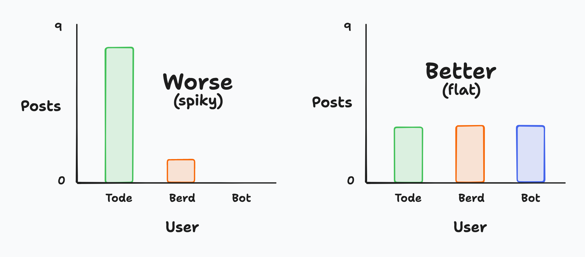
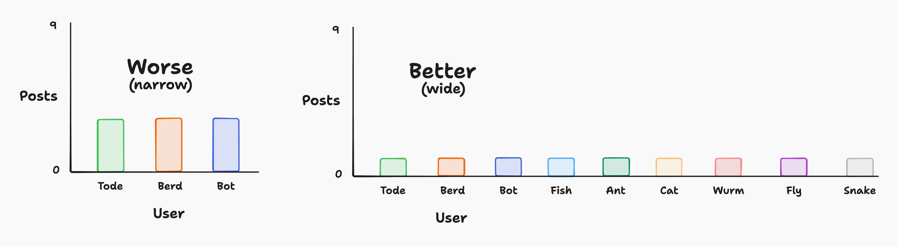

# Intent

This page sets out the intentions and goals of the Lilypad server.

## Specific purpose

The server does not intend to be a general purpose community. That is, it doesn't intend to be a place for all types of topics and types of expression.

Instead, it intends to be a place for a limited range of topics and *vibes*.

Those topics are: 
⭐ coding + creativity 
⭐ nature + cellular automata

And the server is strictly for **celebrating** those topics.

> **Rationale:**
>
> 1. It helps to make moderation easier and less time-consuming, as the server doesn't have to accommodate such a wide range of discussions.
> 2. It helps to focus the server in a specific direction, giving it more of a clear purpose and direction.
> 3. It takes inspiration from the traditional sharing communities of falling sand games, such as the Powder Toy, which is what the TodePond youtube channel originates from.
>
> Not everyone wants such a specific purpose, and that's ok. Some people would rather be part of a more general-purpose community. The Lilypad is for something a little bit different.

## Slow and small

The server does not intend to be as big or as fast-paced as most discord servers.

Instead, it intends to be small and slow enough for someone to reasonably read all new messages by checking in once per day.

> **Rationale:**
>
> 1. There is a lot of joy to be had from being part of a discord server (or equivalent). Many people miss out on this joy because they can't keep up with the scale and speed of most servers - for various reasons.
> 2. The server intends to promote a healthier screen-life balance. It doesn't want to encourage or motivate people to be 'terminally-online', or spend too spend too much time staring at their phone/computer.
>
> Some people prefer a faster-paced server, and that's ok. The Lilypad server is something else.

## Diverse

The server intends to be comprised of users from wide and diverse backgrounds and demographics, especially those that are under-represented within the tech and online world.

> **Rationale:**
>
> 1. No explanation needed.

## Flat and wide

The server intends to have a wide range of people posting, not just a few people dominating the conversation.

We can measure the server's **flatness** to measure the impact of this. First, gather all posts from a given time period (eg: week/month). Then, draw a bar chart of the number of posts per user. If the chart is flat, then the server is doing well. If the chart is spiky, then the server is not achieving its goal.

For example, if there are 9 posts in the past week, from 3 different users, a better outcome would be 3 posts per user. A worse outcome would be 8 posts from one user, and 1 post from another user (and none from the third user).

We can also measure the server's **wideness** to measure the impact of this. First, gather all posts from a given time period (eg: week/month). Then, draw a bar chart of the number of users per post. If the chart is wide, then the server is doing well. If the chart is narrow, then the server is achieving its goal.

For example, if there are 9 posts in the past week, a good outcome would be 9 posts from 9 different users. A worse outcome would be 9 posts from 3 different users.

> **Rationale:**
>
> 1. This is more of a secondary goal that helps to achieve the other goals.
> 2. It also helps to stop the server becoming too cliquey, and becoming dominated by a few people.
